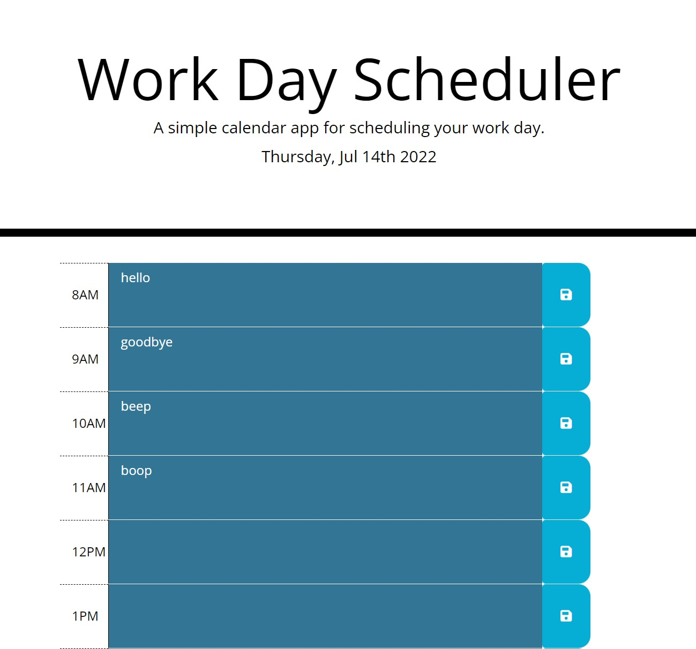

# Work Day Scheduler
Module 5 Challenge 5

## Purpose
To have a functioning browser application that demonstrates the ability to use third party APIs.

## Built With
* HTML
* CSS
* JavaScript
* jQuery
* Bootstrap
* Method.js

## Website
https://xunvyre.github.io/challenge-five-scheduler/

## Screenshot

## Contribution
Xunvyre, Xandromus
